# Code Toolkit: Python, Fall 2021

## Week 6 — Class notes

## Review of last week
Last week we learned about moving from static compositions that create a single fixed frame, to interactive compositions that can respond to mouse input to create kinetic, moving images. In Processing this is often called active mode.

To achieve that we learned some new syntax, mainly, the setup() and draw() blocks:

```
def setup():
    # Things here run once, at the start of your program

def draw():
    # Things here run many times, once per frame
```

In static mode, your sketches ran once in a split second, and then stopped, frozen forever, but now, in active mode, your sketches unfold in human time. Because of this, you need to ask yourself when commands will be executed: once at the beginning of your sketch, or once per frame? With raster images for example, you want to load them once, at the beginning of your sketch, but you will probably want to draw them every frame. You would do that using the code blocks that you just learned about like this:

```
def setup():
    global img
    img = loadImage("some-image.jpg")

def draw():
    global img
    image(img,0,0)
```
NOTE: This is the pattern that you should use for working with raster images from now on.
We also saw how to use mouse movement with built-in variables that Processing defines for us: mouseX and mouseY.

We also talked about pmouseX and pmouseY, and we saw how these special, built-in variables give you the position of the mouse from the previous frame. So if you are curious about that, have a look at the class notes. For example, here is how you could use those two variables to calculate the distance the 
mouse pointer traveled from one frame to another:
```
distance = dist( pmouseX, pmouseY, mouseX, mouseY )
```
And lastly, we saw how we could use these special variables in ways that are more flexible and powerful by using the map() command. This command transltes or "maps" a value or variable proportionally from one range of numbers to another range. For example, the following code uses mouseX to position a rectangle, but limits its movement to a 100 pixel range:

```
rectangleX = map(mouseX, 0,width, 300,400)
rect( rectangleX,300, 50,50 )
```

The lecture notes from last week show several other examples of this command that you can hopefully use as patterns or templates that you can apply to your own work.


Remember to please include a comment at the top of your code with your name, date, and exercise number. For example:
```
"""
    Your name
    Course title & semester
    Date
    Week number    
"""
```

# Making things move and conditionals
This week we will build on last week in two ways.

First, we will learn how to use conditionals so that instead of the continuous change of mouse movement, you can create movement that is discrete and discontinuous.

Second, we will build on our use of variables and Processing's interactive mode to create things that move on their own, not only as directly controlled by the mouse.

S

## Background
Last week we saw how to make interactive compositions, but they were always moving in continuous, connected ways. Colors that changed as smooth gradients, shapes that moved along with the mouse, or that left smooth trails.

Today we will see how to work with one of the fundamental principles of digital media with is how to work with discontinuity, or on/off relationships. This kind of behavior is often described as discrete. (Not to be confused with "discreet"!)

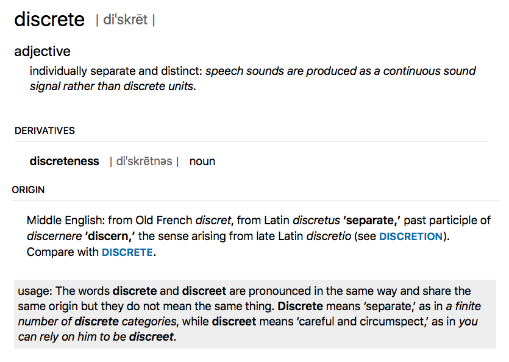

In 1997, the net artist John Simon created a project called [Every Icon](http://www.numeral.com/everyicon/). This conceptul work enacts a play of combinatorics by starting with the first (top, left) pixel of a 32 by 32 grid, and advances in sequence, creating every possible combination of pixels, or in other works, every possible icon.

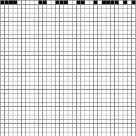

This work emphasizes the way that all digital images are created not as smooth strokes, continuous marks, or smooth lines, but rather always as grids of pixels, always turned either on or off.

To similar ends but in a more poetic and ironic way, the artist Hito Steyerl, in her documentary [How Not to be Seen: A Fucking Didactic Educational .MOV File](https://www.artforum.com/video/hito-steyerl-how-not-to-be-seen-a-fucking-didactic-educational-mov-file-2013-51651), explores (and blurs) the boundary between the analog and digital, between the physical world and the world of digital representations, or in other words, between the smooth and the discrete.

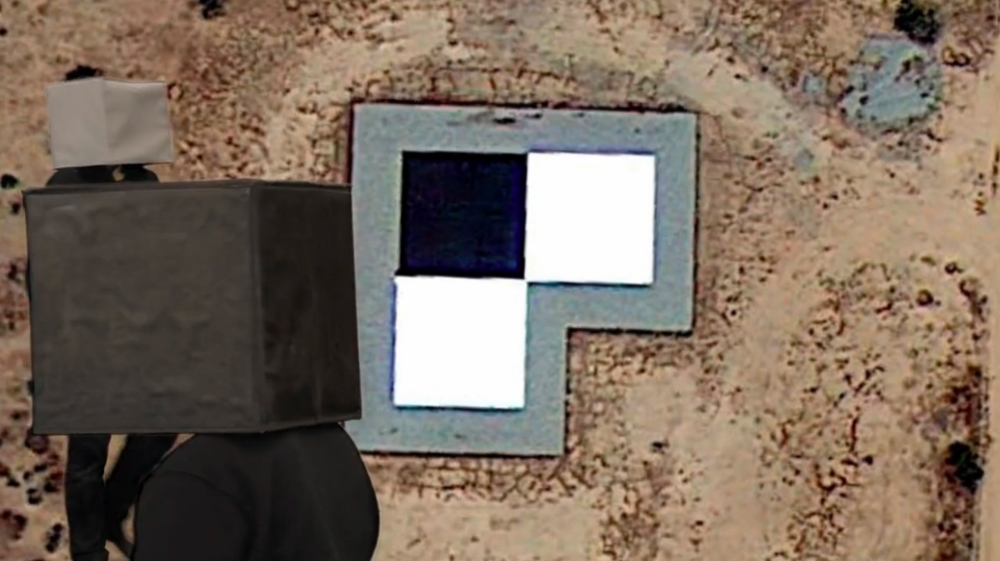

Let's keep all of this in the back of our minds as we explore the logic of discrete on/off structures today and dive in to binary logic.

```mousePressed``` and ```keyPressed```

In addition to mouseX and mouseY, Processing gives us some other built-in variables that we can use to create user interaction:

```mousePressed``` tells us if the mouse is currently being pressed

and 

```keyPressed``` tells us if the any key is currently being pressed

But what is if? So far, variables have only had numeric values. How can a variable tell us "if" something?

These variables are of a new kind of value. We say that they are a new type, and it is called ```Boolean```
.
Just like with the numerical values and variables that we have been using, Boolean variables can be used whenever we want to keep track of something with only two possible values: yes or no, on or off, visible or hidden. Their value is always only either True or False. So you would

use them like this:

```
isDrawing = False
```

or like this:

```
isDrawing = True
```

Notice that I'm writing ```True``` and ```False``` as valid Python code. That is because they are actual values that you can use in your code just like numbers, which in technical jargon we call literals. So far we have seen numerical literals like 0, 1, 2, 10, 300, etc, and string literals like "hello". Now we have the Boolean literals ```True``` and ```False```. You can see this if you use print() to display the value of mousePressed:

```
def setup():
    size(512, 512)

def draw():
    print(mous
```

But how do we actually use these variables?

## Conditionals

Conditionals are ways of asking if something is happening or not, and to allow our code to have different behavior in each case.
Your code can now be more than one simple set of top-down instructions, and can instead have the possibility of doing different things depending on various variables, calculations, and user actions.

A note on pseudocode. (Pronounced, "SOO-doh code".) So far, all the code that I've shown you has been valid Python/Processing syntax. You could copy/paste it into the PDE and it would run. Now we will start talking about a thing called pseudocode. Pseudocode is basically plain English, but with some bits of valid code in it. There are not hard and fast rules about valid pseudocode. Rather, it is a way of writing out an algorithm in English with bits of actual code in it. It is a way to describe an algorithm and work it out, without implementing it yet.
    
```
If the answer to some question is Yes:
    then run some commands
```

As an example, let's start with this code that draws a circle in the middle of the window:

```
def setup():
    size(600,600)

def draw():
    background(255)
    ellipse(300,300, 50,50)
```

Now, let's draw this circle only if the user is pressing the mouse by adding this new syntax for conditionals:

```
def setup():
    size(600,600)

def draw():
    background(255)
    if mousePressed:
        ellipse(300,300, 50,50)
```

Some new syntax rules:

You write if followed by a Boolean variable (or an expression that evaluates to ```True``` or ```False``` — we'll look at these below).
You do not need to put your Boolean expression in parentheses, but they are optional. Later on when working with more complicated logic, you will see examples in which you will need or want parentheses here.

Notice the indentation. The if statement introduces a new code block, so after your Boolean expression, you add a colon, and the next line must be indented. The block continues until you stop indenting. The block can contain any arbitrary Python / Processing statements that you wish, and we say that all of the statements of this block are inside this if statement.

Most importantly: The code inside the if statement only gets run if the Boolean expression evaluates to True.
Think of this as allowing you to ask questions, like, "Is the mouse being pressed?" I recommend reading the above code in pseudocode in the following way:

```
If the mouse is being pressed,
    then draw an ellipse.
```

You can combine questions together using boolean operators.

```and```, both parts must be True
```or```, only one part must be True (either or both is fine)
```not```, the expression that follows must be False
Here are some examples:

```
if mousePressed and keyPressed:
    ellipse(300,300, 50,50)
If the mouse is being pressed and
  any key is being pressed,
    then draw an ellipse.
if mousePressed or keyPressed:
    ellipse(300,300, 50,50)
If either the mouse is being pressed or
  any key is being pressed,
    then draw an ellipse.
if not mousePressed:
    ellipse(300,300, 50,50)
  If the mouse is not being pressed
    then draw an ellipse.
```

In addition to the special Boolean variables mousePressed and keyPressed, you can also ask questions about numbers that you are using in your sketch. Consider the following pseudocode:

```
If the mouse is on the left half of the screen
    then draw an ellipse
Let's get more specific:
  If the mouse x position is less than 300
    then draw an ellipse
And now let's translate that into real Processing code:
```

```
def setup():
    size(600,600)

def draw():
    background(255)
    if mouseX < 300:
      ellipse(300,300, 50,50)
```

The full set of yes/no questions that you can ask about numbers are:

* ```<``` less than
* ```>``` greater than
* ```==``` equal to
* ```<=``` less than or equal
* ```>=``` greater than or equal
* ```!=``` not equal to (This is equivalent to using == and preceding the entire expression with not)

And just as with mousePressed and keyPressed, you can combine these together with boolean operators to ask more complicated questions. Let's start with some basic pseudocode:

```
  If the mouse is being pressed in the left half of the window
    then draw an ellipse
```

Get more specific:

```
  If the mouse x position is less than 300 and
    the mouse is being pressed
    then draw an ellipse
```

And finally translate that into valid Processing syntax:

```
def setup():
  size(600,600)

def draw():
    background(255)
    if ( mouseX < 300 and mousePressed ):
        ellipse(300,300, 50,50)
```

Try moving the mouse to both sides of the window with and without clicking to see exactly what's happening.
In the above examples, if the Boolean expression is False, nothing happens. In other words, if the mouse is not being pressed (to take one example from above) then the code has done nothing. Well let's add another shape:

```
def setup():
    size(600,600)
    # Note that I'm adding the following two lines
    # so that we can see both shapes together,
    # and to draw both shapes at the same x,y
    noFill()
    rectMode(CENTER)

def draw():
    background(255)
    if mousePressed:
        ellipse(300,300, 50,50)

    rect(300,300, 50,50)
```

Note the indendation. The ```rect()``` command is not inside the if statement, so it gets run always. The blank line is not required and I added it only for clarity. As you can see, the if statement applies only to the cirlce, and the square is being drawn always. What if we only want the square to be drawn instead of the circle, in an "either / or" fashion. Well you could use the logical not operator and write two conditionals like this:

```
def setup():
    size(600,600)
    noFill()
    rectMode(CENTER)

def draw():
    background(255)
    if mousePressed:
        ellipse(300,300, 50,50)

    if not mousePressed:
        rect(300,300, 50,50)
```
But, it turns out that this is such a common thing to do in programming that there is a special syntax for it: else

You write this in Python like this:

```
def setup():
    size(600,600)
    noFill()
    rectMode(CENTER)

def draw():
    background(255)
    if mousePressed:
        ellipse(300,300, 50,50)
    else:
        rect(300,300, 50,50)
```

I recommend reading that in pseudocode like this:
```
  If the mouse is being pressed
    then draw an ellipse
  Otherwise, if is not being pressed,
    then draw a rectangle
```
else is kind of like saying "otherwise" in English. It is the thing that happens if none of the conditions are met.
A note on syntax:

if starts a new conditional block. And any time you see if, it is not related to past conditionals. So the above example could have looked like this:

```
if mousePressed:
    ellipse(300,300, 50,50)

# lots of other commands here ...

if not mousePressed:
    rect(300,300, 50,50)
```

and still been valid.

However, else must come immediately after an if block, and it is logically connected to that if statement. So this is invalid:

```
if mousePressed:
    ellipse(300,300, 50,50)

# lots of other commands here ...

else: # INVALID!
    rect(300,300, 50,50)
```

And instead must be written like this:

```
if mousePressed:
    ellipse(300,300, 50,50)
else:
    rect(300,300, 50,50)
```

in which case the logic of the else must be understood in terms of the preceding if. In other words, it means "do something if the mouse is not being pressed."
Let's work on another example starting with the following pseudocode:
```
  If the mouse is on the left of the screen
    then draw a circle
  Otherwise, if it is in the middle of the screen
    then draw a square
  Otherwise, if it is on the right of the screen
    then draw a triangle
In this case, to get more specific, we could say this in two different ways that are both logically equivalent:
  If mouseX < 200
    then draw a circle
  If mouseX >= 200 and mouseX < 400
    then draw a square
  If mouseX >= 400
    then draw a triangle
  If mouseX < 200
    then draw a circle
  Otherwise, if mouseX < 400
    then draw a square
  Otherwise
    draw a triangle
```

Here on the left, we are being explicit about each logical case. While on the right side, we are using this "otherwise" idea to say: "if mouseX is less than 200, then draw a circle, otherwise (if it is not less than 200) if it is less than 400, then draw a square."
This idea of "otherwise if" has its own syntax, and that is elif. We would write the above right-side example in the following way:

```
def setup():
    size(600,600)
    noFill()
    rectMode(CENTER)
 
def draw():
    background(255)
    if mouseX < 200:
      ellipse(300,300, 50,50)
    elif mouseX < 400:
      rect(300,300, 50,50)
    else:
      triangle( 300,275, 325,325, 275,325)
```

This new syntax ```elif``` uses the fact that the first part of the conditional ```(mouseX < 200)``` is ```False```, and then adds another question. So it's like saying "Otherwise, since mouseX is greater than 200, if it is less than 400, then draw a square." And in this example, the final else now says "Otherwise, since mouseX is greater than 400, then draw triangle."

Note that the order is important here. For example, think about what would happen if we switched the order of the first two conditionals. If you wrote the following:

```
if mouseX < 400:
    ellipse(300,300, 50,50)
elif mouseX < 200:
    rect(300,300, 50,50)
else:
    triangle( 300,275, 325,325, 275,325)
```

The square would never get drawn. Why? What would make the first if statement False? If mouseX is greater than or equal to 400. But if this is the case, it could never be less than 200.

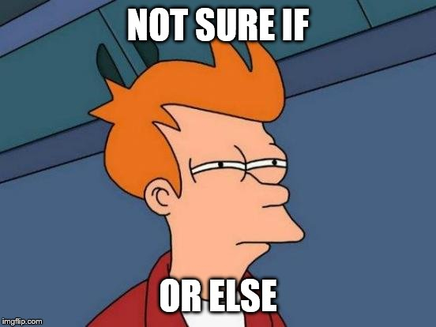

If ```elif``` seems confusing to you, that's OK. It is confusing. Even expert programmers get tripped up about these kinds of logical statements all the time, and they are often the source of time-consuming and expensive bugs. Fortunately, you can write this example in a way that is more clear and readable, and that is also logically equivalent — based on the left-side pseudocode above, like this:

```
def setup():
    size(600,600)
    noFill()
    rectMode(CENTER)
 
def draw():
    background(255)
    if mouseX < 200:
      ellipse(300,300, 50,50)

    if mouseX >= 200 and mouseX < 400:
      rect(300,300, 50,50)

    if mouseX >= 400:
      triangle( 300,275, 325,325, 275,325)
```

This example is totally clear and explicit about each quesiton that you are asking, and is probably the easiest and most understandable way to implement this.

As a final example, let's stitch together several Boolean variables to ask a slightly more complicated question.

Let's start again with some pseudocode:
```
Draw a small square
If the mouse is inside this square
    then draw a circle
```
Start with the basics:

```
def setup():
    size(600,600)
    noFill()
    rectMode(CENTER)
 
def draw():
    background(255)
    rect(300,300, 50,50)
```
Now before we try to implement the conditional, let's diagram what's going on here:


With these coordinates in mind, let's refine our pseudocode:
```
  Draw a small square
  If mouseX is greater than 275 and less than 325, and
     mouseY is greater than 275 and less than 325,
    then draw a circle
```
If that's not totally clear, pause for a second and think through the logic of those comparisons to see how that pseudocode describes a check that the mouse is inside the above box.

Moving forward from there, we can now implement a conditional for this description:

```
def setup():
    size(600,600)
    noFill()
    rectMode(CENTER)
 
def draw():
    background(255)
    rect(300,300, 50,50)
    if mouseX > 275 and mouseX < 325 and mouseY > 275 and mouseY < 325:
        ellipse(300,300, 50,50)
```
Note that you must write mouseX twice. In other words, Python does not allow you to say something like this:

```
  275 < mouseX < 325 # INVALID! Sorry :(
```

You must write it out as:

```
  mouseX > 275 and mouseX < 325
```

In other words, our Boolean comparison operators are binary operators, meaning that they only take two arguments.
If you'd like, if it is more clear to you, you could write it like this:

  ```275 < mouseX && mouseX < 325```

which is equivalent (note the change from > to <). Personally I find this more confusing, but it may look nicer to your eye.

## Inclass Assignment

Draw a Blue Circle in the upper left hand screen when the mouse is in the 1st quad.

Draw a Red Rect in the upper right hand screen when the mouse is in the 2nd quad.

Draw a Yellow Triangle in the lower left hand screen when the mouse is the 3rd quad.

Draw a Green Ellipse in the lower right hand screen when the mouse is the 4th quad.

```
def setup():
    size(600,600)
    rectMode(CENTER)
 
def draw():
    background(255)
    if mouseX < width/2 and mouseY < height/2:
        fill(0, 0, 255)
        ellipse(width/4, height/4, 50, 50)
    elif mouseX > width/2 and mouseY < height/2:
        fill(255, 0, 0)
        rect(3*width/4, height/4, 50, 50)
    elif mouseX < width/2 and mouseY > height/2:
        fill(255, 255, 0)
        triangle(width/4-25, 3*height/4-25, width/4, 3*height/4, width/4+25, 3*height/4-25)
    elif mouseX > width/2 and mouseY > height/2:
        fill(0, 255, 0)
        ellipse(3*width/4, 3*height/4, 50, 25)
    else:
        fill(255, 0, 255)
        rect(width/2, height/2, 100, 100)
```

# BREAK

## Keyboard interaction

So far we've seen how you can use the special Processing variable ```keyPressed``` to let the user press any key to trigger a conditional action. But this only tells us if any key is being pressed or not. What if we want to get more specific and create code that responds to specific keys?

Fortunately, Processing offers us another special variable just for this purpose: ```key``` (Processing reference. That says "example is broken", but it actually seems to work OK for me. Maybe there is something I'm missing.)

With this variable, we are now working with a variable type that I have mentioned before called a string: a bit of text surrounded in single or double quotes. For example: 'a' or "b". You can read more about strings in the Processing reference, or in the Python reference.

Like everything in Python and Processing, strings are case-sensitive, so:
```
print('a' == 'a') # would print True, but

print('A' == 'a') # would print false.
```
Let's add to our example above:
```
def setup():
    size(600,600)

def draw():
    background(255)
    if keyPressed:
        if key == 'e':
            ellipse(300,300, 50,50)
```
Note that I have added a new if statement inside the previous if statement. Programmers call this a nested if statement, because one is inside the block of another. It might look complicated, but hopefully if you think carefully about the logic, it is really simple. Let's think about it with pseudocode:
```
  If any key is being pressed,
    if that key is a lowercase 'e'
      then draw an ellipse.
```
Now where this gets tricky is that there are multiple ways to write this same logic. These ways are all valid, and you can use whichever is more clear and readable for you.

In reading that pseudocode, you might have gotten the impression that I could also have written it like this:
```
  If any key is being pressed,
    and that key is a lowercase 'e'
      then draw an ellipse.
```

and that would make perfect sense. They are logically equivalent. In fact, I could implement that pseudocode in Processing syntax, and it would 

also work perfectly well:

```
def setup():
    size(600,600)

def draw():
    background(255)
    if keyPressed and key == 'e':
        ellipse(300,300, 50,50)
```

Use whichever form makes more sense to you and is easier for you to translate back-and-forth from your natural langauge to Processing syntax. The important thing to understand is that nesting if statements is kind of like and in that both conditional parts must be True.

Now let's expand on that example and see if you prefer one method or the other. What if we want to add a second key command to draw a square?

```
def setup():
    size(600,600)
    rectMode(CENTER) # Adding this back for clarity

def draw():
    background(255)
    if keyPressed and key == 'e':
      ellipse(300,300, 50,50)

    if keyPressed and key == 'r':
      rect(300,300, 50,50)
```

Adding more key commands would simply repeat that pattern. And maybe now you can see here why writing it this way for many key commands might be a little bit annoying. You have to add that keyPressed and check every time. Programmers usually hate redundancy like this and prefer to write things only once if possible, as it makes code less prone to errors.

Let's change it back to the previous style. Making a change like this is called refactoring. This is a fancy word that programmers like to use that just means re-writing code in a way that is equivalent and usually clearer or more efficient. So let's refactor this example:
```
def setup():
    size(600,600)
    rectMode(CENTER)

def draw():
    background(255)
    if keyPressed:
      if key == 'e':
        ellipse(300,300, 50,50)

      if key == 'r':
        rect(300,300, 50,50)
```
With this style, you are only checking that they key is pressed once, and if that is True, you have a series of nested if statements that then check which character was pressed.

## Events

In addition to these conditionals using keyPressed and key, there is even an important third way of handling keyboard interaction. Try running the following code and make very quick key presses:

```
def setup():
    size(600, 600)
    frameRate(60)

def draw():
    if keyPressed:
      ellipse( random(0,width),random(0,height), 50,50 )
```

My goal was to draw a single circle at a random location each time a key is pressed. But one key press will likely draw many circles. That's because the code is responding to a single key press more than once. Because the frame rate is going fast relative to human reflexes, it appears that the user has pressed the key on multiple frame renderings, or in other words, during multiple executions of the draw() block.
Another problematic example would be if you slow down the framerate:

```
def setup():
    size(600, 600)
    frameRate(1)

def draw():
    background(255)
    if keyPressed:
      ellipse(300, 300, 50, 50)
```

This is an exagerated example, but it shows that when you are only checking for key presses inside the draw() block, it is possible that you may not respond to all of them. By pressing keys more quickly than the frame rate refreshes, you are causing Processing to "miss" your action. When the frame is being rendered, you are not pressing the key, you are essentially pressing the key between frames.

These may be behaviors that you want. But if not, there is another option.

A new code block:

```
def keyPressed():
    # commands in here
```

This special block is triggered exactly once, every single time a key is pressed. That means that you don't have to worry about it not being called, and you don't have to worry about it being called more than once.

Also, inside this new block (which must always be global, outside all other blocks), you do not need to check if keyPressed is True. You know that your code is responding to one single key press.

This style of interactive programming is called event handling because your code is handling, or responding to, an event that the user triggers. This is an important part of any game development or user interface coding.

Let's look at our previous example implemented in this way:

```
def setup():
    size(600,600)
    rectMode(CENTER)

def draw():
    background(255)

def keyPressed():
    if key == 'e':
        ellipse(300,300, 50,50)

    if key == 'r':
        rect(300,300, 50,50)
```

Sidenote: There is a similar pattern here for the mouse. The ```mousePressed()``` block is also valid syntax and would be used in a similar way:

```
def setup():
    size(600,600)
    rectMode(CENTER)

def draw():
    background(255)

def mousePressed():
    ellipse( 300,300, 50,50 )
```

# BREAK

## Making things move
Changing topics, let's look at how we can make things move on their own, instead of only moving in response to mouseX and mouseY, as well as mouse and key presses.

This is not a complicated topic and only brings together several things we've already seen, namely: variables, arithmetic, and frameRate.

Let's begin with the simple example that we've been starting with:
```
def setup():
    size(600,600)
    stroke(50,50,150)
    fill(200,200,255)

def draw():
    background(255)
    ellipse( 300,300, 50,50)
```

Now if we want that circle to move side to side, what do we need to add? We want it's position to change and to "vary" ... so we'll add a variable:

```
circleX = 300
def setup():
    size(600,600)
    stroke(50,50,150)
    fill(200,200,255)

def draw():
    background(255)
    ellipse( circleX,300, 50,50)
```

Just by itself, this change isn't going to make the circle move. How could we do that? What we've seen so far would be to use something like mouseX. So we could maybe try to modify draw() like this:

```
def draw():
    background(255)
    global circleX
    circleX = mouseX
    ellipse( circleX,300, 50,50)
```

But what if we want the position of the circle to change "on its own"?

Using pieces that you've already seen, all we'd need to do is modify the value of the variable inside draw() so that it changes a little bit each frame. Like this:

```
circleX = 300
def setup():
    size(600,600)
    stroke(50,50,150)
    fill(200,200,255)

def draw():
    background(255)
    ellipse( circleX,300, 50,50)
    global circleX
    circleX = circleX + 1
```

If that new line is confusing for you to understand, try writing it this way, which is equivalent, and maybe a little more clear:

```
def draw():
    background(255)
    ellipse( circleX,300, 50,50)
    temp = circleX + 1
    circleX = temp
```

That might clarify what may to you look like circular logic of assigning that variable to itself.
But! The circle disappears! How can we make it come back? Let's make it so that if the circle moves off to the right, we have it re-appear at the left. To do this, let's think through some pseudocode:
```
  Draw a circle at location circleX
  Increment the value of circleX by 1
  If the circle goes off the window to the right
    then redraw the circle on the left.
```

Or, getting more specific:

```
  Draw a circle at location circleX
  Increment the value of circleX by 1
  If the circleX > width
    then circleX = 0
```

Now it should be pretty easy to translate this into valid Processing syntax:

```
circleX = 300
def setup():
    size(600,600)
    stroke(50,50,150)
    fill(200,200,255)

def draw():
    background(255)
    ellipse( circleX,300, 50,50)
    global circleX
    circleX = circleX + 1
    if circleX > width:
      circleX = 0
```

Nice! I'm sure with a little adjusting, you can modify that so that we let the circle completely disappear, and then re-appear smoothly. (Hint: you can set circleX to a negative value.)

Let's get a little more complicated. What if we don't want the circle to re-appear on the other side, but rather to "bounce" off the wall of the window? Now, instead of only moving to the right, sometimes we'll want the shape to move to the left. In other words, we want the direction of the circle to change. And when we want something to change, what do we need?

A variable.

So let's add a new variable for the direction of the circle:

```
circleX = 300
circleDirection = 1
def setup():
    size(600,600)
    stroke(50,50,150)
    fill(200,200,255)

def draw():
    background(255)
    ellipse( circleX,300, 50,50)
    global circleX
    circleX = circleX + circleDirection
    if circleX > width:
      circleX = 0
```

So far nothing has changed. I've merely swapped in a variable for a hard-coded value. But now, instead of changing the position of the circle when it hits the wall, I want to change the direction. Like this:

```
circleX = 300
circleDirection = 1
def setup():
    size(600,600)
    stroke(50,50,150)
    fill(200,200,255)

def draw():
    background(255)
    ellipse( circleX,300, 50,50)
    global circleX
    global circleDirection
    circleX = circleX + circleDirection
    if circleX > width:
      circleDirection = -1
```

Great. But now it disappears off the left side. How do we fix this? Do we need a new variable? To answer that, ask yourself: is anything new is changing? No, nothing new is changing, so we don't need a new variable. But we want to change when and how that variable changes. In order to do that, there is another question that we want to ask and respond to. Let's work through the pseudocode:

```
  Draw a circle at location circleX
  Increment the value of circleX by 1
  If the circleX > width
    then change the increment to -1
And how do we want to modify this?
  Draw a circle at location circleX
  Increment the value of circleX by 1
  If the circleX > width
    then change the increment to -1
  If the circleX < 0
    then change the increment to 1
```

Looks like we need another conditional. Let's add that:

```
circleX = 300
circleDirection = 1
def setup():
    size(600,600)
    stroke(50,50,150)
    fill(200,200,255)

def draw():
    background(255)
    ellipse( circleX,300, 50,50)
    global circleX
    global circleDirection
    circleX = circleX + circleDirection
    if circleX > width:
        circleDirection = -1
    if circleX < 0:
      circleDirection = 1
```

Great!

Let's add one more thing. Let's allow the user to also change the circle direction by pressing some keys. Let's use 'j' for left and 'l' for right. All we need to add is the keyPressed() block and two conditionals:

```
circleX = 300
circleDirection = 1
def setup():
    size(600,600)
    stroke(50,50,150)
    fill(200,200,255)

def draw():
    background(255)
    ellipse( circleX,300, 50,50)
    global circleX
    global circleDirection
    circleX = circleX + circleDirection
    if circleX > width:
        circleDirection = -1
    if circleX < 0:
      circleDirection = 1

def keyPressed():
    if key == 'j':
        circleDirection = -1

    if key == 'l':
        circleDirection = 1
```

And now, believe it or not, you have all the basic pieces to implement a game like Pong. To be clear, Pong combines many of these elements in a way that may still appear complex, but you should be able to look at this code and have some understanding of what is going on. Take a look:

# In Class Activity

```
circle_x = 0
circle_y = 0
circle_dir_x = 1
circle_dir_y = 1

def setup():
    size(600, 600)
    frameRate(60)

def draw():
    global circle_x, circle_y, circle_dir_x, circle_dir_y
    background(255)
    ellipse(circle_x, circle_y, 100, 100)
    circle_x = circle_x + circle_dir_x
    circle_y = circle_y + circle_dir_y
     
    if circle_x > width-50:
        circle_dir_x = -1
    if circle_x < 50:
        circle_dir_x = 1
        
    if circle_y > height-50:
        circle_dir_y = -1
    if circle_y < 50:
        circle_dir_y = 1
    
    pass
      
def keyPressed():
    global circle_dir_x, circle_dir_y
    if key == 'a':
        circle_dir_x = -1
    if key == 'd':
        circle_dir_x = 1
    if key == 'w':
        circle_dir_y = 1
    if key == 's':
        circle_dir_y = -1
    pass

def keyReleased():
    global circle_dir_x, circle_dir_y
    if key == 'a':
        circle_dir_x = 0
    if key == 'd':
        circle_dir_x = 0
    if key == 'w':
        circle_dir_y = 0
    if key == 's':
        circle_dir_y = 0
    pass
    
def mousePressed():
    global circle_dir
    circle_dir = circle_dir * -1
    pass
```


# Notes about Time:

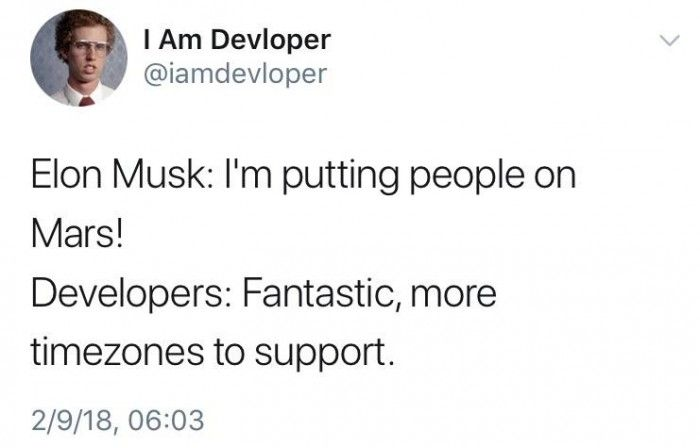

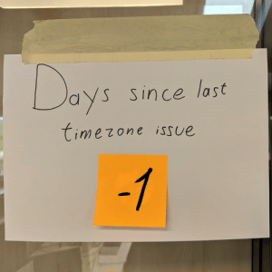

```
print(day())
print(hour())
print(millis())
print(minute())
print(month())
print(second())
print(year())
```


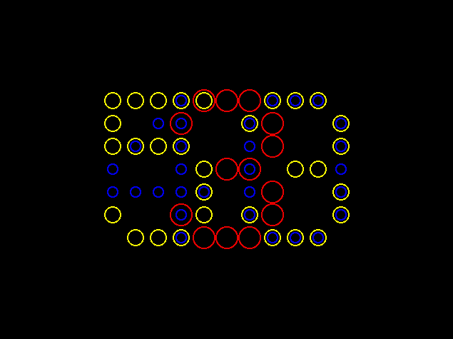
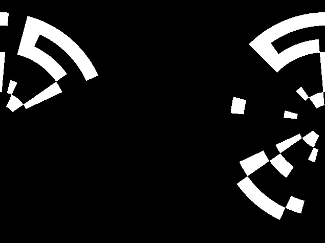


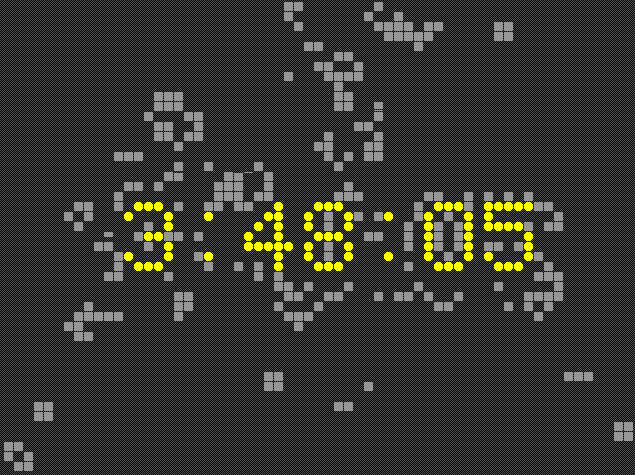
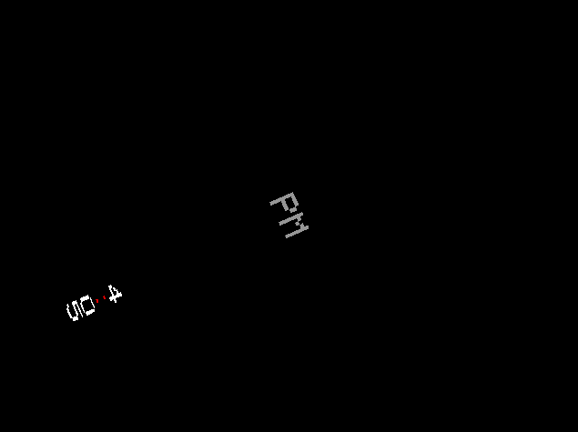

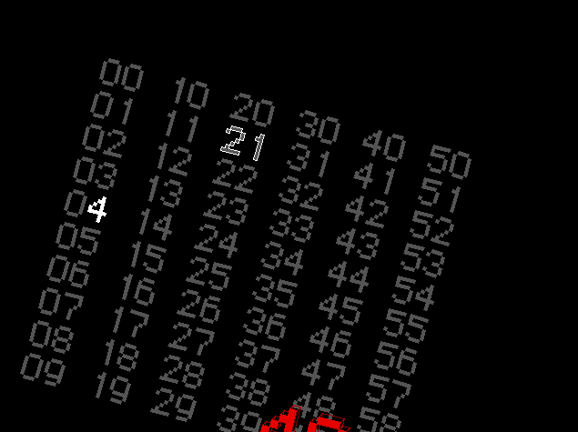
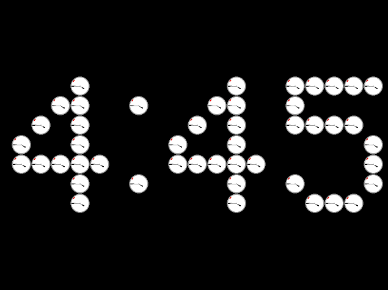
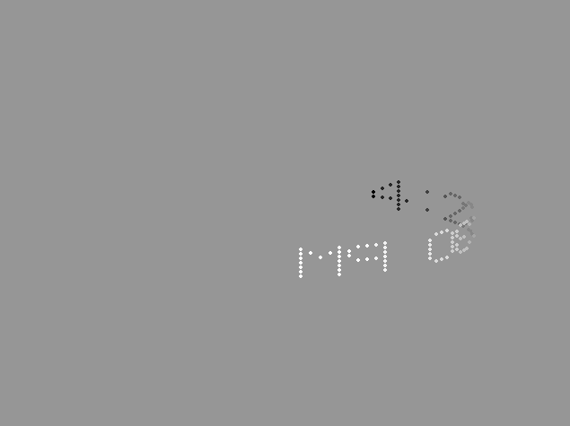
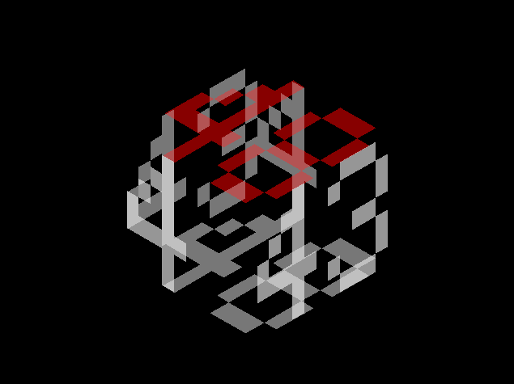

### Home Work
* Coding Assignment #3 : A Clock w/ an Alarm
* Reading Selections from Matthew Fuller, [Software Studies: A Lexicon: Introduction, "Algorithm", "Code", "Programmability", and "Source Code".](https://monoskop.org/images/a/a1/Fuller_Matthew_ed_Software_Studies_A_Lexicon.pdf)
